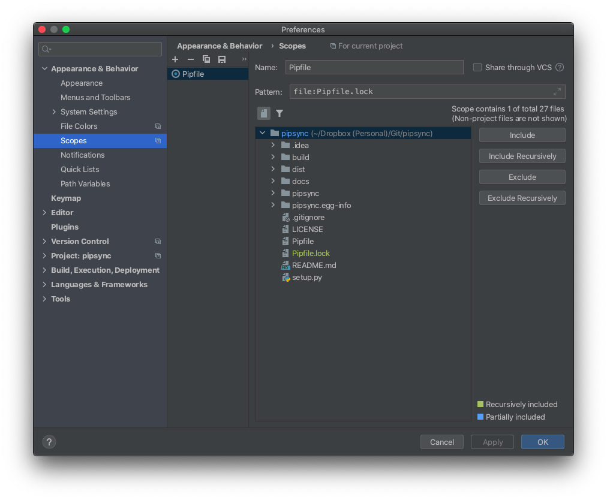

# PyCharm Integration

Instructions on integrating _Pipsync_ into PyCharm.

## FileWatcher

### Custom Scope

Enable _Pipsync_ to run every time your `Pipfile.lock` is modified.

1. In _PyCharm's_ menu go to `PyCharm -> Appearance & Behavior -> Scopes` and click `"+"`:

    

1. Label the new scope ("Pipfile" is used in the screenshot").

1. Select the `Pipfile.lock` file and click `Include`.

1. Click `Apply` to save your changes.

### Add File Watcher

1. Install _Pipsync_ and copy the path to its installation:

    ```shell script
    % which pipsync
    /Library/Frameworks/Python.framework/Versions/3.8/bin/pipsync
    ```

1. In _PyCharm's_ menu go to `PyCharm -> Preferences -> Tools -> File Watchers` and click `"+"`:

    

1. Set the `File Type` to `Any` (the only file in scope is `Pipfile.lock`).

1. Set the `Scope` to the custom scope created in the previous section (e.g. the "Pipfile" scope).

1. Paste the path to _Pipsync_ in the `Program` field.

1. Set the `Arguments` to `$FilePath$`.
    - It is here you can customize the remaining arguments to use with _Pipsync_.

1. Under `Advanced Options` enabled `Trigger watcher on external changes`.

1. Click `OK` and then `Apply` to save your changes.
